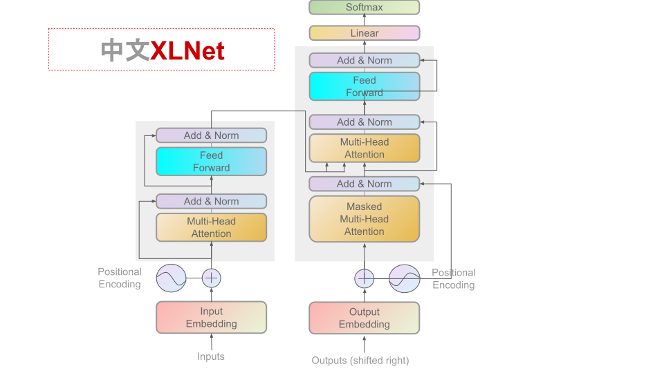

[**中文说明**](./readme.md) | [**English**](./readme_en.md)

<p align="center">
    
</p>
<p align="center">
    <a href="https://github.com/shendezhou/Chinese-PreTrained-XLNet/blob/master/LICENSE">
        
    </a>
</p>

This project provides a Chinese oriented xlnet pre training model, which aims to enrich Chinese natural language processing resources and provide a variety of Chinese pre training models.
We welcome all experts and scholars to download and use them, and work together to promote and develop the construction of Chinese resources.

This project is based on CMU / Google official xlnet：https://github.com/zihangdai/xlnet

Other related resources：
- Chinese xlnet pre training model：https://github.com/ymcui/Chinese-XLNet

See more published resources：https://github.com/ 

## NEWS
**2021/2/4 All models support pytorch, tensorflow1 and tensorflow2. Please call or download them through the transformers library. https://huggingface.co/**


<details>
<summary>Historical news</summary>
2021/2/4The models published in this directory can be accessed to [hugging face transformers](https://github.com/huggingface/transformers) in the future, view [quick load](#quick load)

2021/2/4 `XLNet-tiny`It can be downloaded. View [Model Download](#model download)

2021/2/4 provides a Chinese 'xlnet tiny' model trained on a large-scale general corpus (1.76gb). Check [Model Download] (# model download)
</details>

## Content guidance
|Chapter | description|
|-|-|
|[Model Download] (# model download) | provides the Chinese pre training xlnet download address|
|[baseline system effect] (# baseline system effect) | some baseline system effects are listed|
|[pre training details] (# pre training details) | relevant description of pre training details|
|[fine tuning details of downstream tasks] (# fine tuning details of downstream tasks) | description of fine tuning details of downstream tasks|
|[FAQ] (#faq) | FAQ|
|[reference] (# reference) | technical report of this catalogue|

## Model Download
* **`XLNet-tiny`**：6-layer, 768-hidden, 12-heads, 72M parameters(71766926)


| Model abbreviation | corpus | Google download | Baidu cloud Download|
| :------- | :--------- | :---------: | :---------: |
| **`XLNet-tiny, Chinese`** | **Chinese Q &amp; A / <br/> General Data<sup>[1]</sup>** | **[TensorFlow1](https://drive.google.com/drive/folders/1-4ZFSuVvgAEazcqnCwELQhBEKOszUTvn?usp=sharing)** <br/>**[TensorFlow2](https://drive.google.com/drive/folders/1-hzDQ9fKkhwqCFEH1TVMXEj_VN4mG_2b?usp=sharing)** <br/>**[PyTorch](https://drive.google.com/drive/folders/1-3RteqvOeyE3qvmRADq2P7ifYNHsO7Kt?usp=sharing)** | **[TensorFlow1,密码:tfxl](https://pan.baidu.com/s/1sUKsad2ZS6xQkUdxrj0qfw)** <br/>**[TensorFlow2,密码:tfxl](https://pan.baidu.com/s/1kWDgTEuF-E8MhZ6V-3xczw)** <br/>**[PyTorch,密码:toxl](https://pan.baidu.com/s/1bdNtnz1Lts-24zhBtoxIRQ)** |

> [1] The general data includes: question and answer data, the total size is 1.74gb, the number of records is 720000, and the number of words is 9.83 million.

### PyTorch/Tensorflow Versions

Pytorch version, TF1 and TF2 version are provided.

### instructions

The Chinese mainland recommends the use of Baidu cloud download points. Overseas users recommend using Google download points. The `XLNet-tiny` model file size is about **343M**. Take tensorflow version 'xlnet tiny, Chinese' as an example. After downloading, unzip the zip file to get the following results:

```
tf_chinese_xlnet_tiny_L-6_H-768_A-12.zip
    |- checkpoint                                           # 存盘点信息
    |- xlnet_tiny_chinese.ckpt.data-00000-of-00001          # 模型权重
    |- xlnet_tiny_chinese.ckpt.index                        # 模型index信息
    |- xlnet_tiny_chinese.ckpt.data                         # 模型meta信息
    |- spiece.vocab          # 分词词表
    |- spiece.model          # 分词模型
```

TensorFlow2 version：

```
tf2_chinese_xlnet_tiny_L-6_H-768_A-12.zip
    |- tf_model.h5           # 模型权重
    |- config.json           # 模型参数
    |- spiece.vocab          # 分词词表
    |- spiece.model          # 分词模型
```

Pytorch version：

```
chinese_xlnet_tiny_L-6_H-768_A-12.zip
    |- pytorch_model.bin     # 模型权重
    |- config.json           # 模型参数
    |- training_args.bin     # 模型训练信息
    |- spiece.vocab          # 分词词表
    |- spiece.model          # 分词模型
```

###Fast loading
Relying on [hugging face transformers 3.1.0](https://github.com/huggingface/transformers) The above models can be easily called.
```
tokenizer =  AutoTokenizer.from_ pretrained("MODEL_ NAME")
model =  AutoModel.from_ pretrained("MODEL_ NAME")
```

Where ` model_ The corresponding list of name ` is as follows:
|Model name | model_ NAME |
| - | - |
| XLNet-tiny-Chinese | /chinese-xlnet-tiny<sup>[1]</sup>|

>[1] to upload, you need to download manually.


## Baseline system effect
In order to compare the baseline effect, we conducted tests on the following Chinese data sets. This paper compares Chinese best WwM ext, xlnet base and xlnet tiny.
Limited time and energy, and can not cover more categories of tasks, please try.

### Simplified Chinese word segmentation: MSR 2005
**[MSR 2005数据集](http://aclweb.org/anthology/I05-3017)** MSR is a Chinese word segmentation dataset published in 2005.
For details, see Thomas Emerson. 2005. The second international Chinese word segmentation Bakeoff. In procedures of the fourth sight Workshop on Chinese language processing
According to the given sentence, the model needs to give an appropriate partition, so that the words with joint meaning are combined together.
The evaluation index is ACC / F1

| Model | development set ACC / F1 | validation ACC / F1 | test set |
| :------- | :---------: | :---------: | :---------: |
| LSTM | 0.9526 /	0.94500|	0.940177 /	0.92627 |
| BERT-wwm-ext<sup>[1]</sup> | 0.96106 /	0.95476|	0.95565 /	0.9465  |
| **XLNet-tiny** | 0.9880 / 0.9863 |  **0.9679**  /    **0.96184** |
| **XLNet-base**<sup>[2]</sup> | 0.9988 /	0.99853 |	**0.9825** /	**0.97877**|

> [1] BERT-wwm-ext：It was put forward by Cui Yiming and others[BERT-wwm](https://github.com/ymcui/Chinese-BERT-wwm)。  
> [2] XLNet-base：It was proposed by Cui Yiming (iFLYTEK Joint Laboratory of Harbin Institute of Technology) and others[XLNet](https://github.com/ymcui/Chinese-XLNet)。


## Pre training details
The following takes the 'xlnet tiny' model as an example to explain the details of pre training.


### Generating Thesaurus
According to the official xlnet tutorial steps, you need to first use [Sentence piece](https://github.com/google/sentencepiece) Generate a vocabulary.
In this project, we use the vocabulary size of 21128, and the rest of the parameters use the default configuration in the official example.

```
SentencePieceTrainer.train(
    input=paths, 
    model_prefix='model/spbpe/spiece',  
    vocab_size=21_128, 
    user_defined_symbols=[]
)
```


### Pre training
After obtaining the above data, the pre training of xlnet was officially started.
The reason why it is called 'xlnet tiny' is that compared with the number of 'xlnet base' layers (12 layers reduced to 6 layers), the number of vocabularies has changed from 32000 to 21128, and other parameters have not changed, mainly because of the limitation of computing equipment.
The command used is as follows:
```
    from transformers import XLNetConfig,XLNetTokenizer,XLNetLMHeadModel,LineByLineTextDataset,DataCollatorForPermutationLanguageModeling,Trainer, TrainingArguments
    
    config = XLNetConfig(
        vocab_size=21_128,
        d_model=768,
        n_head=12,
        n_layer=6,
)

    tokenizer = XLNetTokenizer.from_pretrained("./model/spbpe", max_len=512)

    model = XLNetLMHeadModel(config=config)
    model.resize_token_embeddings(len(tokenizer))
    print(model.num_parameters())

    dataset = LineByLineTextDataset(
        tokenizer=tokenizer,
        file_path="./data/data_train.csv",
        block_size=128,
)

    data_collator = DataCollatorForPermutationLanguageModeling(
        tokenizer=tokenizer, plm_probability=1.0/6, max_span_length=5
)

    training_args = TrainingArguments(
        output_dir="./model/xlnet_v1",
        overwrite_output_dir=True,
        num_train_epochs=5,
        per_gpu_train_batch_size=32,
        save_steps=10_000,
        save_total_limit=2,
)

    trainer = Trainer(
        model=model,
        args=training_args,
        data_collator=data_collator,
        train_dataset=dataset,
        prediction_loss_only=True,
)

    trainer.train()

    if trainer.is_world_master():
        trainer.save_model("./model/spbpe")
```


## Fine tuning details of downstream tasks

The device used for downstream task fine tuning is Google cloud GPU (16g HBM). The following briefly describes the configuration of each task fine tuning.

**Please refer to [exlnet](https://github.com/ShenDezhou/EXLNet) for relevant codes Project. **


## FAQ

**Q: Will larger models be released? **

A: Not necessarily, not guaranteed. If we get a significant performance improvement, we will consider publishing it.


**Q: Not good on some datasets? **

A: Choose another model or continue to pre train with your data on this checkpoint.


**Q: Will pre training data be released? **

A: Sorry, it can't be published because of copyright issues.


**Q: How long did it take to train xlnet? **

A: Xlnet tiny uses cloud TPU V3 (128G HBM) to train 30K steps (batch = 32), which takes about 8 hours.


**Q: Why does xlnet not officially release multilingual or Chinese xlnet? **

A:

(the following is my personal opinion) I don't know. Many people leave a message saying they hope to have it(https://github.com/zihangdai/xlnet/issues/3)。

In terms of the official technology and computing power of xlnet, it is not difficult to train such a model (the multilingual version may be more complex, and the balance between different languages needs to be considered. Please also refer to [multilingual Bert](https://github.com/google-research/bert/blob/master/multilingual.md) It is described in.

**On the other hand, the authors have no obligation to do so. **

As scholars, their technical contributions are enough and should not be published or criticized, calling on everyone to treat others' work rationally.


**Q: Is xlnet better than Bert in most cases? **

A: At present, it seems that at least the effects of the above tasks are not bad, although the data used, and the published [bert WwM ext](https://github.com/ymcui/Chinese-BERT-wwm) It's different.


## Citation
If the contents in this catalogue are helpful to your research work, you are welcome to quote the following technical reports in the paper:
https://arxiv.org/abs/
```
TBD
```


## Thank you
Project Author: tsinghuaboy
During the construction of the project, the following warehouses have been referred to. Thank you here:
- XLNet:  https://github.com/zihangdai/xlnet

## Disclaimer
This project is not [xlnet official](https://github.com/zihangdai/xlnet) Published Chinese xlnet model.
The content of the project is only for technical research reference, not as any conclusive basis.
Users can use the model freely within the scope of the license, but we are not responsible for the direct or indirect losses caused by using the content of the project.

## Focus on us
Welcome to Zhihu column.
[learning interest group](https://www.zhihu.com/column/thuil)

## Problem feedback &amp; contribution
If you have any questions, please submit them in GitHub issue.
We don't have an operation to encourage netizens to help each other solve problems.
If you find implementation problems or are willing to build the project together, please submit a pull request.